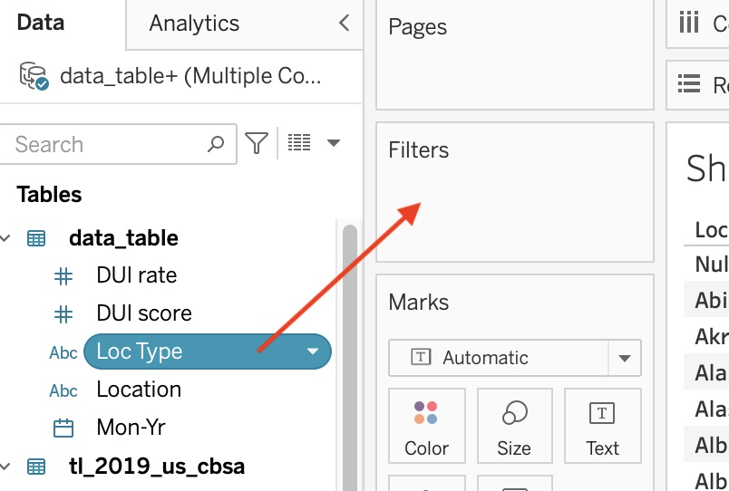

# NCDS Internship Tableau Workshop
Instructor: Peace Ossom-Williamson

Access the files on [GitHub](.). 
Download and then unzip in order to have an `ncdstableauworkshop` folder. All data files are in the `data` folder.

## Overview

Let’s explore the price of gasoline in the United States and vehicle travel behavior. Our data table comes from five data sets. All U.S. data are provided by Month from January 1993 to June 2022.

### Table of Contents
1. About
     - [Gas Price Data](#gas-price-data)
     - [U.S. Miles Traveled Data](#miles-traveled-data)
     - [State and MSA Data](#state-and-msa-data)
     - [MSA Shapefile](#shapefile)
2. [Tableau Visualizations](#tableau-steps)
     - [Connecting to Data and Joining Tables](#connecting-to-data-and-joining-tables)
     - [Creating a Bar Chart](#creating-a-bar-chart)
     - [Creating a Line Chart](#creating-a-line-chart)
          - [Creating a Calculated Field](#creating-a-calculated-field)
     - [Creating a Scatterplot](#creating-a-scatterplot)
     - [Creating a Map](#creating-a-map)
3. [Creating a Dashboard](#creating-a-dashboard-of-all-your-visualizations)
4. [Publishing Your Dashboard](#publishing-your-dashboard)

### GAS PRICE DATA

Three data sets are recording the monthly price per gallon of gasoline in the United States, for the period of April 1993 to May 2022. Drawing on these data sets, we will be looking at fuel price information collected by the U.S. Bureau of Labor Statistics (2022), the U.S. Energy Information Administration (2022, June 13), and the Consumer Price Index (2022) by the U.S. Bureau of Labor Statistics.

#### Sources

1. gp_bls-unleaded: U.S. Bureau of Labor Statistics, Average Price: Gasoline, Unleaded Regular (Cost per Gallon/3.785 Liters) in U.S. City Average [APU000074714], retrieved from FRED, Federal Reserve Bank of St. Louis; <https://fred.stlouisfed.org/series/APU000074714>, June 19, 2022.
> The U.S. Bureau of Labor Statistics collects information about gasoline prices monthly from seventy-five urban areas of the United States monthly, through mail questionnaires. Variable definition: Average U.S. cost of unleaded regular gasoline per gallon by month.

2. gp_eia: U.S. Energy Information Administration. (2022, June 13). U.S. All Grades All Formulations Retail Gasoline Prices. U.S. gasoline and diesel retail prices [Data Set]. <https://www.eia.gov/dnav/pet/pet_pri_gnd_dcus_nus_a.htm>
> The information in this dataset is compiled by the U.S. Energy Information Administration, and collected at 8:00 a.m. Monday mornings, on a weekly basis at stations across the country. According to the Methodology for EIA Weekly Retail Gasoline Price Estimates, information on regular, mid-grade, and high-grade gasoline are collected, to provide a more balanced comparison of consumer prices available. These prices are then compiled to provide averages at the city, county, state, regional, and national levels. Variable definition: Weekly retail gasoline and diesel prices
(dollars per gallon).

3. gp_bls-all: U.S. Bureau of Labor Statistics. (2022). Top picks (most requested statistics) - Gasoline, all types, per gallon/3.785 liters in U.S. city average, average price, not seasonally adjusted & Gasoline, unleaded regular, per gallon/3.785 liters in U.S. city average, average price, not seasonally adjusted. U.S. Bureau of Labor Statistics - Consumer Price Index [Data set]. <https://data.bls.gov/cgi-bin/surveymost?ap>
> Similarly, to the unleaded information compiled for the U.S. Bureau of Labor Statistics, the 
Consumer Price Index information represents a national market, and does not limit their sampling to a specific geographic area. The index does differ in that they attempt to regularly rotate the locations where they sample product prices, and do not adjust data for seasonal availability, which more accurately reflects the market (CPI: Average price data). Variable definition: Average U.S. cost of all types gasoline per gallon by month.

[⬆Back to Table of Contents](#table-of-contents)

### MILES TRAVELED DATA

The data for miles traveled will show how many total miles vehicles traveled that month.

#### Source

4. Milestraveled: U.S. Federal Highway Administration, Vehicle Miles Traveled [TRFVOLUSM227NFWA], retrieved from FRED, Federal Reserve Bank of St. Louis; <https://fred.stlouisfed.org/series/TRFVOLUSM227NFWA>, June 23, 2022.
> Vehicle Miles Traveled and the 12-Month Moving Vehicle Miles Traveled series are created by appending the recent monthly figures from the FHWA’s Traffic Volume Trends to their Historic Monthly Vehicle Miles Traveled (VMT) data file. Variable definition: Total vehicle miles traveled in the U.S. by month.

[⬆Back to Table of Contents](#table-of-contents)

### STATE AND MSA DATA

Vehicle-related data for states and metropolitan statistical areas is provided from one data source. 

#### Source

5. U.S. Department of Transportation. (2015, October 27). Transportation and Health Tool. <https://www7.transportation.gov/transportation-health-tool>

The variables include
| Variable Name             | Variable Definition                                                                |
|---------------------------|------------------------------------------------------------------------------------|
|     Location              |     Name of the state or MSA                                                       |
|     Loc_Type              |     Type of location. 2 possible values: State, Metropolitan   Statistical Area    |
|     DUI_rate              |     DUI/DWI Fatalities per 10,000 Residents: Raw Value                             |
|     DUI_score             |     DUI/DWI Fatalities per 10,000 Residents: Score*                                |
|     personmiles           |     Distance a Person Travels in a Year by Private Vehicle: Raw Value              |
|     vehiclemiles          |     Total annual miles of vehicle travel per Capita: Raw Value                     |
|     vehiclemiles_score    |     Vehicle Miles Traveled per Capita: Score*                                      |

\* *To make results easier to interpret, the website provides scores for states, metropolitan statistical areas, and urbanized areas on a scale of 0 to 100, where higher values are better. The score for a given state or area represents its percentile value. This is the percent of states or regions that score below it. Read more about how scores are calculated at <https://www7.transportation.gov/mission/health/tool-scoring-methodology>*

[⬆Back to Table of Contents](#table-of-contents)

### SHAPEFILE

The MSA shapefile comes from one data source. It must be downloaded and used as a ZIP file.

6. U.S. Census Bureau. (2021, October 12). TIGER/Line Shapefile, 2019, nation, U.S., Current Metropolitan Statistical Area/Micropolitan Statistical Area (CBSA) National [Data set]. <https://catalog.data.gov/dataset/tiger-line-shapefile-2019-nation-u-s-current-metropolitan-statistical-area-micropolitan-statist>

[⬆Back to Table of Contents](#table-of-contents)

## Tableau Steps

### Connecting to Data and Joining Tables
1. Upload the Excel file in Tableau using the left menu. Change to "Extract" since we will have more than one data source.

2. Change data types as needed. You can create calculated fields here or later while in the sheets.

3. To connect to the shapefile, click "Add." Then select "Spatial File." Select the zip file.

4. To join these two, double-click the `data_table` in the center of the page. (Or, right-click and select "Open.") Complete a left join using "Location" for the data_table and "Name" for the shape file. As a secondary effort to ensure correct matching, you can also indicate that the "Loc Type" variable should equal "Metropolitan Statistical Area" in a custom join calculation.

*Note: There should still be 785 rows.*

[⬆Back to Table of Contents](#table-of-contents)

### Creating a Bar Chart

**Let's look at the top 10 states where people drive the most.**

5. Click on "Sheet 1" at the bottom to create your first visualization.

*Note: Tableau will prompt you to save the data extract. Press the "Save" button.*

6. Drag `Location` to "Rows."

     
8. Since we are only focused on the states, drag "Loc Type" to the Filters box.

9. Check the box by `State,` leaving the other 2 options (`null` and `Metropolitan Statistical Area`) unchecked. You'll see that we now are only showing data for the 50 states.
10. Drag `Personmiles` to "Columns." Then sort the bars by size using the sort button.

11. Count the first ten states with the highest person miles, then select the 11th-50th states by selecting the 11th state (Kansas) and then using the "Shift" key while selecting the last state (Hawaii). Then right-click the selection and choose "Exclude."

12. To directly label the bars, drag `Personmiles` to the "Label" square. Then remove the y-axis by right-clicking it and unchecking the "Show Header" option.

13. Rename the sheet by double-clicking the tab at the bottom. Give it a full title, such as "Top 10 States for Average Miles a Person Has Driven Annually."

[⬆Back to Table of Contents](#table-of-contents)

### Creating a Line Chart

**Let's now create a visualization of the gas prices over the years.**

14. Each visualization lives on its own sheet. To create a new sheet, click the small tab that has an icon that looks like a bar chart with a plus sign.

15. Drag `Mon-Yr` to "Columns" and 2 variables to "Rows": `Gp Bls-All` and `Gp-Eia`. To put them together, right-click `Gp-Eia` in the "Rows" row, and select "Dual Access."

> #### Creating a Calculated Field
> 
> **Since these two variables are similar measures of the same information, we can average them together to create one variable of gas prices.**
> 
> 16. To create this calculated variable, right-click an empty area on the right menu (or right-click `Gp Bls-All`), then choose "Create" and "Calculated Field." 
> 
> 
> 
> 17. Change the title of the new variable from "Calcuation 1" to "Gp Avg". Then, place the following formula in the big white box: `(SUM([Gp Bls-All])+ SUM([Gp Eia]))/2`
> 

18. Now that we are back on our line chart, remove the two gas price variables in the "Rows" row. To add multiple variables as lines, we can drag "Measure Names," which lists all our variables, to the "Filters" box. Click the <kbd>None</kbd> button to uncheck everything. Then, only select `Gp Avg` and `Gp Bls-Unleaded`. Push the <kbd>OK</kbd> button to see the average cost of all gas compared with the average cost of unleaded.
19. To add another variable (on a different scale), drag `Milestraveled` onto "Rows," then right-click it and check "Dual Axis."

20. Also, there are two points on the x-axis we should remove: `Null` and `2022`. Right-click and "Exclude" each one.

21. Then, you can rename the sheet to be "How Have Gas Prices and Travel Distances Changed between 1993 and 2021?"

[⬆Back to Table of Contents](#table-of-contents)

### Creating a Scatterplot

**Let's see if ther is any relationship between gas prices and how much people drive.**

22. To start, drag `Gp Avg` to "Columns" and `Milestraveled` to "Rows." You'll only see one dot.

23. To make this a scatterplot, go to the top menu and choose "Analysis" then uncheck "Aggregate Measures."

24. You can change the color, size, labels, and types of marks on your scatterplot by using the "Marks" menu on the left of the visualization.

25. You can add a trendline by clicking "Analysis" in the top menu again. This time, choose "Trend Lines" and "Show Trend Lines."
26. Rename the scatterplot "Do People Travel Fewer Miles when Gas Prices Go Up?"

[⬆Back to Table of Contents](#table-of-contents)

### Creating a Map
**Let's use our MSA/CBSA shapefile to look at driving behavior in U.S. MSAs.**

27. Drag `Geometry` to the center of your sheet to see all the U.S. Metropolitan Statistical Areas.

28. Next drag `DUI score` to the "Color" square in the Marks menu. 

30. Notice that they are all still one color. You'll need to go to "Analysis" in the top menu, and uncheck "Aggregate Measures."
31. Once they are colored by `DUI score`, you can choose to change the color. To do so, click the down-pointing arrow in the top right of the DUI score legend and choose "Edit Colors." There are a variety of options to choose from. Click <kbd>Apply</kbd> to see the changes without exiting the menu.

31. Then drag `Location` to the Tooltip square so that the name of the MSA appears when you hover over it.

32. Rename the sheet to be "DUI Score by MSA".

[⬆Back to Table of Contents](#table-of-contents)

### Creating a Dashboard of All Your Visualizations

**Once you have created a few visualizations, you can add them together on one dashboard, making an interactive infographic.**

33. To start, click the "New Dashboard" tab at the bottom which shows a table of 4 cells with a plus sign.

> On the left menu, there are options to resize the dashboard space, to choose which sheet to drag onto the dashboard (hover your mouse over it to get a peak of any chart), and options to add other items to your dashboard, like spacers, additional text, and images.
> 
> 

When you have the "Tiled" option selected near the bottom of the left menu, it will tile the selected visualizations and fill the entire dashboard. If you select "Floating," you can place a chart wherever you'd like. You can have some (or all) charts floating or tiled. You can also remove keys/legends that are not useful to you.

34. Play around with the dashboard to get familiar with these features!

[⬆Back to Table of Contents](#table-of-contents)

### Publishing Your Dashboard

**To publish any one item, you must have that item appearing on the screen. Let's publish the dashboard.**

35. To publish the dashboard go to the "Server" option in the top menu, the select the following: Tableau Public > Save to Tableau Public. (You may first have to create an account if you don't have one already. Otherwise you should sign in.)

This saves your file to the Tableau Public server, placing the visualization online and available to link to and embed.

[⬆Back to Table of Contents](#table-of-contents)
